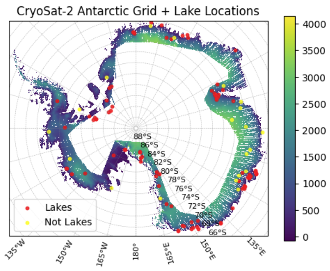
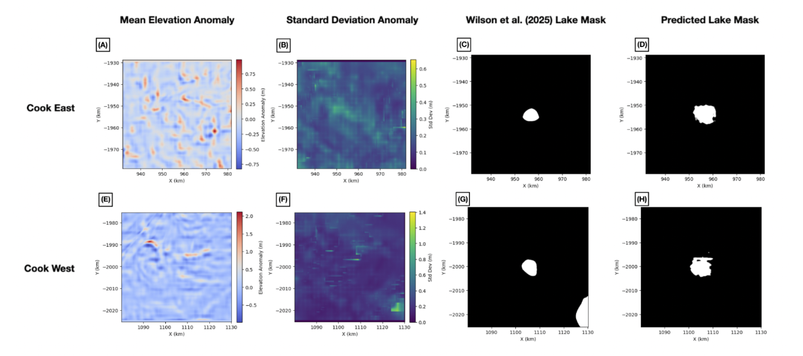
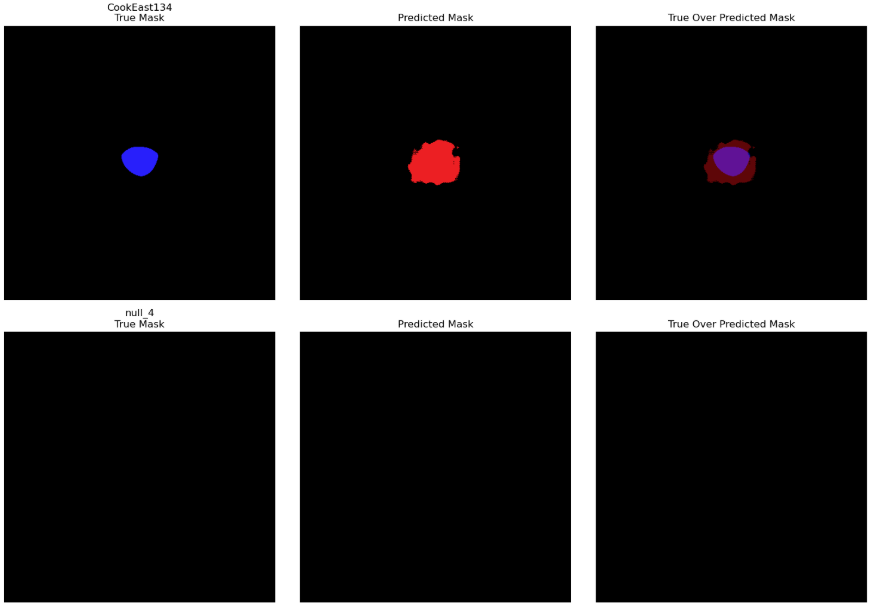
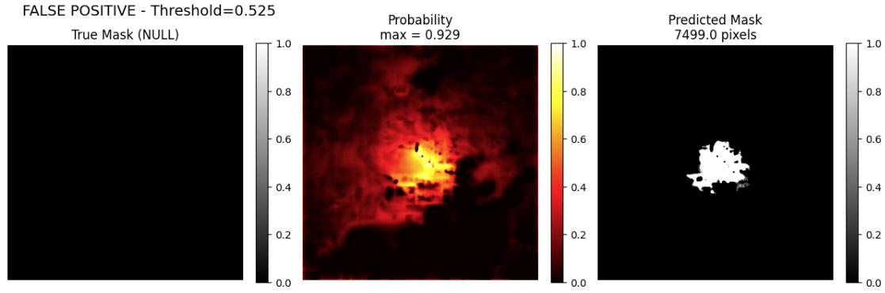
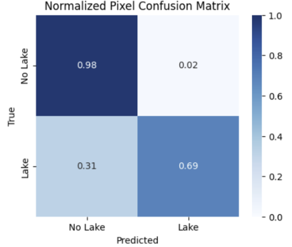
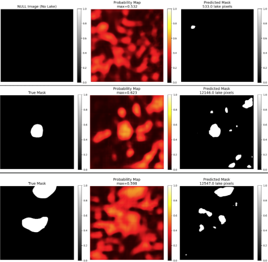
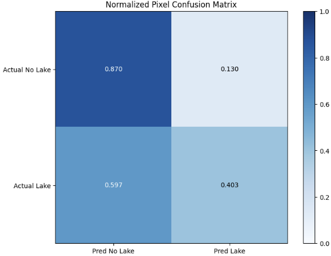
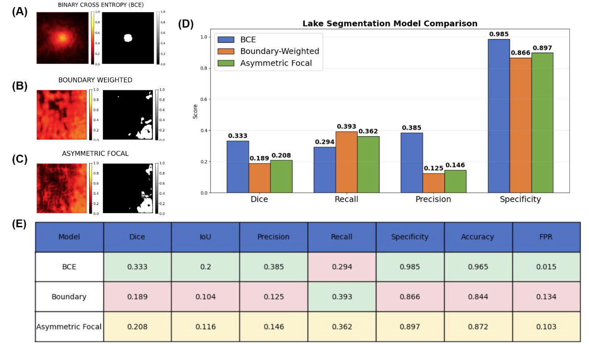

# MLGEO 2026: Subglacial Lakes
Project group classifying spatial distribution of subglacial lakes in Antarctica

## The Team

**ESS 569:** Ashley Howard

**ESS 469:** Cameron Boyd, Olivia Murdock, Sofia Suhinin

## Introduction
Active subglacial lakes are important indicators of the hydrology and stability of the Antarctic ice sheet. As climate change continues to warm the poles and destabilize ice sheets, it is important for us to monitor changes to the mass of the ice sheet to understand and predict changes in global sea level. Monitoring the presence of subglacial lakes is one piece of the puzzle, but identifying the active lakes is a laborious process that requires processing a large amount of satellite altimeter data. Through this project, we hoped to answer if we could use machine learning models to classify the spatial distribution of subglacial lakes in Antarctica using CryoSat-2-derived surface elevation data. 
## Background
Subglacial lakes are bodies of water trapped beneath the ice sheets formed by geothermal and frictional heating and basal water inputs and drainage (Livingstone et al., 2022). They can be either stable (no change in volume over time) or active (experiencing draining or filling events). Active lakes are detectable remotely through satellite altimetry because the draining and filling causes the surface elevation to fall and rise respectively. 

CryoSat-2 and ICESat-2 both provide altimeter data over our region of interest, the continent of Antarctica. Fan et al. (2022) provides a comparison of the CryoSat-2 and ICESat products for the identification of active subglacial lakes. We ended up using CryoSat-2 over ICESat-2 because the earliest ICESat-2 data begins in 2018, and the rarity of draining and filling events would have limited the lakes we were able to validate a machine learning model against. Wilson et al. (2025) identified 85 active subglacial lakes using CryoSat-2 data and provided positions, shapefiles, and records of the draining and filling events for these lakes. The lakes identified by Wilson et al. form the basis of the dataset we generated since the shape and position of each lake could be verified. 

Recent work has also used machine learning to identify the positions of lakes in the Gamburtsev Province in East Antarctica (Ma et al., 2025). The Ma et al. study uses radio-echo sounding data to identify lakes, so the lakes are not necessarily active. To implement a remote sensing method, we must examine active lakes.
## Inputs/Outputs
**Data Processing**: 

We used the L3 gridded CryoSat-2 elevation data product. The spatial resolution of the original data is every 250-500 meters along track with 5344 ground tracks across the dataset. The temporal resolution is every 30 days, and the portion of the dataset we used is from July 2010 to December 2020. We also used the Reference Elevation Model of Antarctica (REMA) from the Polar Geospatial Center. REMA is a high-resolution DEM constructed from optical satellite measurements that is mostly timestamped to 2015. It is often used in the literature to calculate height anomalies, so we subtracted it from our CryoSat-2 data to calculate height anomaly. The version we used was on a 100m grid. The CryoSat-2 data was on a 2km grid, so we linearly interpolated between each grid cell before subtracting to get the final anomalies. We generated 50km2 tiles centered on each lake location, as well as 20 null tiles that are known to not have lakes. The positions of each tile are shown in Figure 1, and an example tile for lake Cook East is shown in Figure 2.

<figure>
  
  <figcaption> Figure 1. CryoSat-2 Antarctic grid with the locations of the known lake and null tiles generated for training and testing the model.</figcaption>
</figure>

<figure>
  
  <figcaption> Figure 2. Example elevation anomaly tile for all timesteps centered on lake Cook East 134. </figcaption>
</figure>

**Inputs**: 

We flattened our 113 total timesteps into two tiles for the input: the mean and standard deviation of the height anomaly through time. We also generated binary lake masks from the shapefiles provided by Wilson et al. to use as labels for training or to validate or test the model results. We split our dataset into 70% training (n=73), 15% validation (n=16), and 15% test (n=16). The mean, standard deviation, and lake mask for two lakes are shown in the first three columns of Figure 3. 

**Outputs**:

The output of our model was a probability map for each pixel in the tile that was converted into a binary lake mask using p>0.5 indicating presence of a subglacial lake in that pixel. Example outputs are shown in the last column of Figure 3.

<figure>
  
  <figcaption> Figure 3. Content and caption created by Sofia Suhinin. Model input features and lake mask predictions for Cook East (top row; A – D), and Cook
West (bottom row; E – H). All panels show spatial coordinates (km) in the polar stereographic projection. Panels (A, E) show the mean elevation anomaly drive from the CryoSat-2 elevation time series, and Panels (B, F) show the standard deviation of elevation anomalies. Panels (C,G) show the “observed” subglacial lake masks derived from the Wilson et al. (2025) validation set. Panels (D,H) show the corresponding lake masks predicted by the CNN U-Net Round 1 Model, where the elevation anomaly statistics were used as input features. Regions with surface elevation anomalies correlated with observed subglacial lakes, where the model predicted the approximate lake locations/boundaries in both regions - Cook East (D) and Cook West (H). The model produced a dice similarity metric of
0.055 when comparing the overlap between true and predicted masks. While the model can find lakes in the center, it fails to find lakes elsewhere, i.e., Panel G has a lake in the SE corner of the panel that does not appear in the predicted lake mask. Therefore, modifications such as data augmentation, image fitting and cropping, and applying a dynamically lower learning rate were applied to improve model performance.</figcaption>
</figure>

## ML Approach

We chose to use a U-Net model, a specialized type of CNN adapted for image segmentation, since our problem involves breaking down "images" of elevation to indicate individual pixels with subglacial lake presence. We also found in the literature that this type of model has been used for similar problems involving tundra lake identification from satellite imagery (Abramova et al., 2024). The model architecture itself is U-shaped, made up of an encoder that applies convolutions followed by maxpool downsampling and a decoder that applies upsampling, concatenation, and convolutions.

At the training stage, we input our mean and standard deviation anomalies as well as their true lake masks for each training file. Then, the encoder extracts spatial patterns from the anomaly patterns, and the decoder reconstructs the image resolution to produce pixel-by-pixel predicted lake classification. We implemented a Binary Cross Entropy (BCE) loss function, which is useful since our expected outputs and verification are binary, and this loss function penalizes confident wrong predictions. We also applied a class weight since the loss function is sensitive to class imbalances and our dataset has only 2.6% true lake pixels that are vastly dominated by the non-lake pixels.  

The training took place over 15 epochs. Then, we used our test set to demonstrate the functionality and test the final accuracies. Final accuracies were assessed by confusion matrices and dice score, where the dice score indicates the overlap between the true lake masks and the predicted lake mask. 

We attempted to improve the model with a second round of training and testing using data augmentation. Our original data set only had 73 training images and all lake-containing samples had the lakes centered in the images. We implemented data augmentation by creating patches with different flips, rotations, and cropping to increase our data set to 292 training samples. We also lowered the learning rate and combined BCE and dice loss functions in the training.

## Results

The results of our first round of of testing had some agreement with the original lake masks. Figure 4 shows an example from Cook East and one of the null samples. However, we did see many false positives. For example, the null sample in Figure 5 had high probability of a lake in the center of the tile and predicted a centered lake where there was none. Our assessment of the model performance is shown in Figure 6, where our model does a good job of predicting where lakes are not, but a mediocre job of predicting where lakes are (indicating an issue with false negatives as well as false positives). The dice score for the first round was 0.055.

<figure>
  
  <figcaption> Figure 4. The top row of tiles from left to right show the true mask, predicted mask, and their overlap, and the bottom row shows the same for a null (no lake) sample. </figcaption>
</figure>

<figure>
  
  <figcaption> Figure 5. From left to right, a null sample original mask, its probability layer with strong center probabilities, and the predicted mask indicating a false positive. </figcaption>
</figure>

<figure>
  
  <figcaption> Figure 6. Normalized pixel confusion matrix for round 1 of the model. </figcaption>
</figure>

The second round of model training implemented the improvements described in the above section. We found that the new loss metric was able to better quantify the difference in the bulk of the lakes identified rather than just focusing on how the boundaries overlap. This gave us a dice score of 0.276, an improvement from the first round of testing. Examples of the true and predicted masks for a null sample and 2 lakes are shown in Figure 7. The bottom row of Figure 7 shows the performance on a non-centered lake near the edge of the image which the model is able to identify successfully.

<figure>
  
  <figcaption> Figure 7. Round 2 model performance example. The top row shows a null sample with its probability map and predicted mask, the center row shows a centered lake example, and the bottom row shows performance on a sample with a non-centered lake. </figcaption>
</figure>

The model performance for round 2 was also characterized with a normalized pixel confusion matrix. The performance looks worse on all counts compared to the original model training, but the higher confusion levels show that the model is engaging with more complexity in placing lakes within the images now that not all lakes are centered. 

<figure>
  
  <figcaption> Figure 8. Normalized pixel confusion matrix for round 2 of the model. </figcaption>
</figure>

Figure 9 shows the performance of the first two rounds of models, as well as a third model that incorporated an asymmetric focal loss function that prioritized correct identification of lake pixels since they are a rare class. The strong performance of the first model relative to the other two is likely due to overfitting of our dataset. Of the other two models, the asymmetric focal loss round had the best performance in terms of dice score, precision, and specificity. See the caption of Figure 9 for a detailed description of the model performance metrics comparison.

<figure>
  
  <figcaption> Figure 9. Content and caption created by Cameron Boyd. Performance comparison of the three models we used on our problem. The first architecture had a loss function based solely on
binary cross entropy, which equally weighted the accuracy of each pixel’s prediction. The outcome of this model when applied to a null,
lake-less image is shown in Panel (A). The left side of the figure is a probability map, where brighter pixels were predicted to have a higher
probability of representing lakes. The right side of the figure is the final mask predicted by the model, where all pixels with a probability
greater than 0.5 are marked as containing a lake and represented in white. This early draft of the model did not augment images, so the
model overfit the pattern of lakes being centered in the input images. The second version of the model de-emphasized pixel-by-pixel
accuracy, instead focusing on raising the dice score, which is a measure of how well the predicted mask overlaps with the true mask. The
loss function for this model also dynamically adjusted weights to place less emphasis on boundary pixels, since we were more concerned
with finding the bulk of the lake. We used image augmentation including random flips, rotations, and cropping to prevent overfitting. We also
used image patching, by breaking up the images into subsections, passing them through the model, and then reconstructing the output into
a full image. This resulted in some strange edge effects, as seen in the model output in Panel (B). The boundary-weighted model was
applied to the same null image as in Panel (A), and there is a visible uptick in inaccuracies along the bottom and right edges. The third model
used asymmetric focal loss, a method that places more emphasis on correctly identifying lake pixels, because they are a rare class that
make up less than 5% of our data. This loss function placed less emphasis on the easy to classify background pixels, making the training
process focus more on correctly identifying lake pixels. Combined with image augmentation, this loss function was effective. Panel (C)
shows this asymmetric focal model applied to the same null mask, which again shows weird edge effects in the bottom right that are
connected to our image patching method. Panel (D) explores metrics used to asses the models’ performances. Although the binary cross
entropy model (shown in Panel (A)) seems to outperform the others, it is overfitting our data. It would not be generalizable to other data sets.
Panel (E) further explores performance metrics. For each column, the green represents the best performance, red represents the worst
performance, and yellow is the performance in the middle. If we throw out the binary cross entropy model due to overfitting, we can
compare the remaining two. The asymmetric focal model (shown in Panel (C)) outperforms the boundary-weighted model (shown in Panel
(B)) in every aspect except recall, a ratio of the predicted positives out of the total number of actual positives. However, since the
boundary-weighted model still has a worse false positive rate (FPR), the asymmetric focal model seems preferable for finding the most lakes
with the highest accuracy.  </figcaption>
</figure>

## Discussion

Our model overall does a better job at predicting where lakes are *not* than predicting where lakes *are*. The correct identification of a lake pixel using this method is near-random. We believe that the primary driver of this issue is that this problem is inherently data limited. Even with the dataset of recently discovered lakes, only about 2.6% of the pixels in our images were truly belonging to subglacial lakes. With this model, we were also only able to input the mean and standard deviation of the lake time series to limit dimensionality, but the primary method of identifying active subglacial lakes depends on a change over time. Since the slices of each tile were snapshots of the elevation anomaly, the standard deviation should be able to show where more variability in the anomaly exists, but a truly 3D model incorporating time could be more effective for this problem. 

## Future Work

Future work could address the data limitation by using models like CycleGAN to generate synthetic remote sensing data (Heuver, 2025). We did not implement synthetic data in this round of testing due to time limitations, but it would be interesting to see how a model trained on synthetic data might perform on real test data. 

We also recognize the need to implement a 3D CNN that incorporates the full time series since this problem in inherently dependent on time. Changes in the elevation anomaly are theoretically the only way to identify active subglacial lakes from remote sensing data.

Lastly, we would like to apply this model to ICESat-2 data to expand the monitoring of subglacial lakes and Antarctic hydrology to remote sensing that will continue past the retirement of CryoSat-2. It would also be interesting to test the model on Arctic elevation data in Greenland. 

## References

Abramova, I. A., Demchev, D. M., Kharyutkina, E. V., Savenkova, E. N., & Sudakow, I. A. (2024). Utilization of the U-Net Convolutional Neural Network and Its Modifications for Segmentation of Tundra Lakes in Satellite Optical Images | Atmospheric and Oceanic Optics | Springer Nature Link. (n.d.). Retrieved March 17, 2026, from https://link.springer.com/article/10.1134/S1024856024700404

Fan, Y., Hao, W., Zhang, B., Ma, C., Gao, S., Shen, X., & Li, F. (2022). Monitoring the Hydrological Activities of Antarctic Subglacial Lakes Using CryoSat-2 and ICESat-2 Altimetry Data. Remote Sensing, 14(4), 898. https://doi.org/10.3390/rs14040898

Heuver, N. (2025). Generating Synthetic Remote Sensing Data with Deep Learning for Improved Wetland Classification—UBC Library Open Collections. (n.d.). Retrieved March 17, 2026, from https://open.library.ubc.ca/collections/researchdata/items/1.0448454

Livingstone, S. J., Li, Y., Rutishauser, A., Sanderson, R. J., Winter, K., Mikucki, J. A., Björnsson, H., Bowling, J. S., Chu, W., Dow, C. F., Fricker, H. A., McMillan, M., Ng, F. S. L., Ross, N., Siegert, M. J., Siegfried, M., & Sole, A. J. (2022). Subglacial lakes and their changing role in a warming climate. Nature Reviews Earth & Environment, 3(2), 106–124. https://doi.org/10.1038/s43017-021-00246-9

Ma, Q., Hao, T., Feng, T., Qiao, G., Nandi, A. K., & Lv, C. (2025). Automated Prediction of Gamburtsev Subglacial Lakes in East Antarctica With Optimized Stacking Ensemble Learning. IEEE Transactions on Geoscience and Remote Sensing, 63, 1–16. https://doi.org/10.1109/TGRS.2025.3587133

Wilson, S. F., Hogg, A. E., Rigby, R., Gourmelen, N., Nias, I., & Slater, T. (2025). Detection of 85 new active subglacial lakes in Antarctica from a decade of CryoSat-2 data. Nature Communications, 16(1), 8311. https://doi.org/10.1038/s41467-025-63773-9
